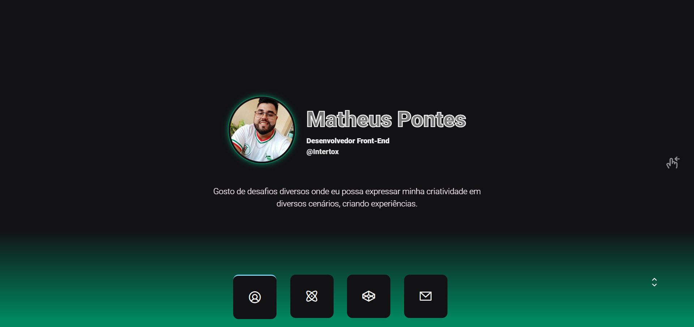

# Projeto portfolio
- [Acesso ao projeto](https://matheuspontes.vercel.app/)

- A ideia do projeto é mostrar minha criatividade e destacando alguns projetos que julguei ser mais importantes, sem acompanhar um tutorial por completo.
- O projeto é "diferentes dos iguais", usei a lib Swiper para criar slides. 
- Então ao invês de ir descendo como nas páginas tradicionais, vocês vai deslocando para o lado 
- Utilizei uma combinação de cores que gosto e que foi utilizado em um evento da empresa Rocketseat.
    - [Projeto em questão](https://github.com/Matheus-Pontes/IgniteLab-02)

# Layout 
- 

# Tecnologias
- HTML 5
- CSS 3
- JS
    - [Swiper - lib de accordions](https://swiperjs.com/)