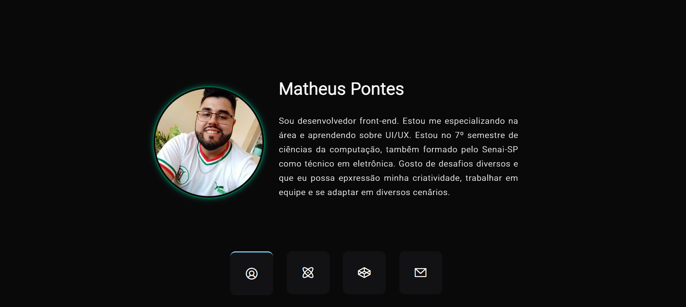

# Projeto portfolio
- [Acesso ao projeto](https://matheuspontes.vercel.app/)
- A ideia é mostrar um pouco de quem eu sou e mostrar alguns projetos front-end que realizei.

# Layout 
- 

- O projeto é "diferentes dos iguais", usei a lib Swiper para criar slides. 
- Então ao invês de ir descendo como nas páginas tradicionais, vocês vai deslocando para o lado 
- Utilizei uma combinação de cores que gostei e que foi utilizado em um evento da empresa Rocketseat.

# Tecnologias
- HTML 5
- CSS 3
- JS

